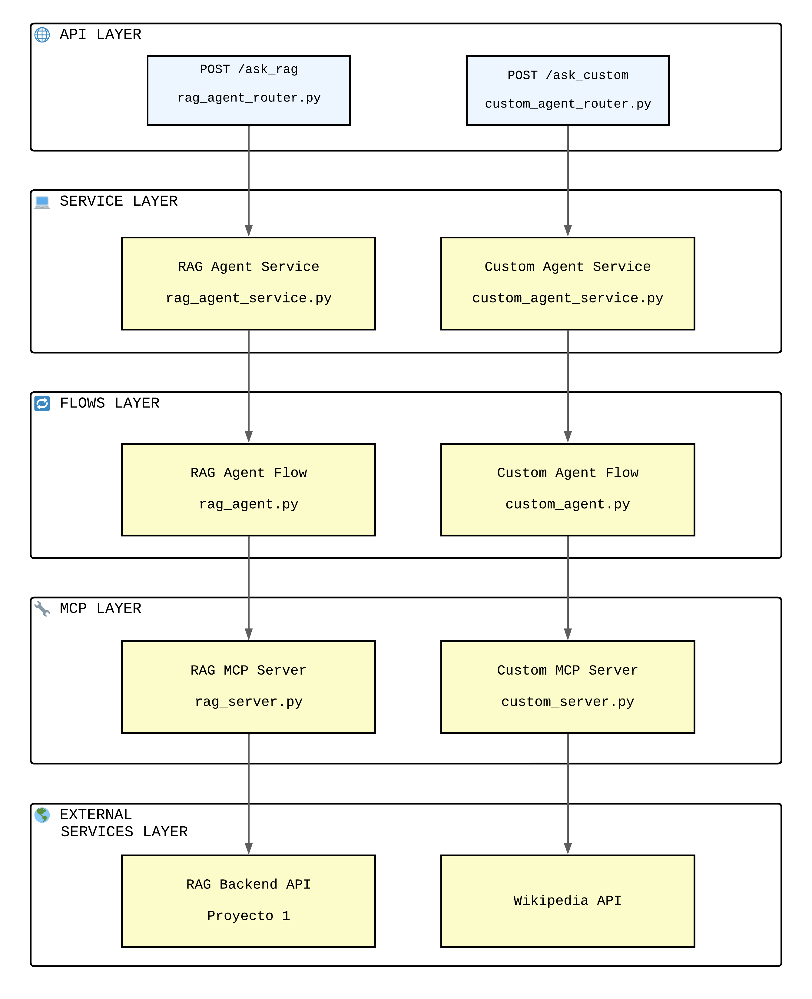
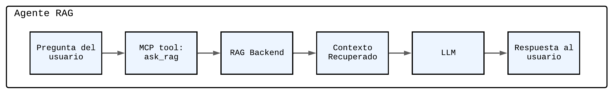
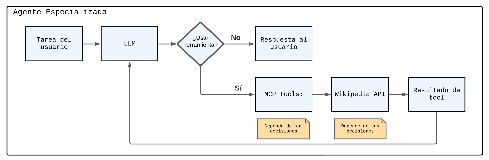

# 202515 MISW4411 Agent Backend

Backend centrado en **agentes inteligentes** y uso de **Model Context Protocol (MCP)** del curso **Construcción de Aplicaciones basadas en Grandes Modelos de Lenguaje (MISW4411)** de la **Maestría en Ingeniería de Software – Universidad de los Andes**.

---

## 📋 Tabla de Contenidos

- [📖 Descripción](#descripción)
- [🏗️ Arquitectura del Sistema](#arquitectura)
- [📁 Estructura del Proyecto](#estructura)
- [🚀 Instalación y Ejecución](#instalación)
- [⚙️ Configuración](#configuración)
- [🌐 Endpoints del API](#endpoints)

---

## 📖 <a id="descripción">Descripción

Este es un **template de backend con agentes inteligentes** desarrollado en **FastAPI** que implementa una arquitectura basada en **agentes conversacionales** utilizando **LangGraph** y **Model Context Protocol (MCP)**.

### Características principales

- **Arquitectura de Agentes**: Implementación de agentes con LangGraph
- **Model Context Protocol (MCP)**: Integración de herramientas externas mediante MCP
- **Dos tipos de agentes**:
  - **RAG Agent**: Agente conectado a sistema RAG para recuperación de información
  - **Custom Agent**: Agente ReAct con herramientas personalizadas (Wikipedia)
- **API REST**: Endpoints documentados con FastAPI
- **Docker**: Containerización completa del sistema
- **CORS**: Configurado para integración con frontend

---

## 🏗️ <a id="arquitectura">Arquitectura del Sistema

El sistema está organizado en cinco capas orientadas a la construcción de agentes. El diagrama de arquitectura se divide en dos columnas: la izquierda muestra el **Agente RAG**, cuya implementación corresponde a la Semana 6 del curso, mientras que la derecha presenta el **Agente Especializado**, que desarrollarán durante la Semana 7.



### 📊 Descripción de las capas

#### **API Layer (FastAPI)**

- **Responsabilidad**: Exponer endpoints REST para consultas a los agentes
- **Componentes**:
  - `rag_agent_router.py`: Endpoint `/ask_rag` para consultas RAG
  - `custom_agent_router.py`: Endpoint `/ask_custom` para agente personalizado
  - CORS middleware para integración con frontend

#### **Service Layer (Agent Services)**

- **Responsabilidad**: Gestionar el ciclo de vida de los agentes y sus conexiones MCP
- **Componentes**:
  - **RAG Agent Service**: Inicializa sesión MCP, carga herramientas, crea agente RAG
  - **Custom Agent Service**: Inicializa sesión MCP, carga herramientas, crea agente personalizado
  - Gestión de estado y sincronización con `asyncio.Lock`

#### **Flows Layer (LangGraph Workflows)**

- **Responsabilidad**: Definir la lógica de flujo de cada agente usando LangGraph
- **Componentes**:
  - **RAG Agent Flow** (`rag_agent.py`):
    - Workflow lineal simple
    - Nodos: `ask` (recuperar contexto) → `llm` (generar respuesta)
  - **Custom Agent Flow** (`custom_agent.py`):
    - Workflow ReAct con ciclo
    - Nodos: `llm` (razonar) ↔ `tools` (actuar) hasta completar tarea

#### **MCP Layer (Tool Servers)**

- **Responsabilidad**: Proveer herramientas mediante Model Context Protocol
- **Componentes**:
  - **RAG MCP Server**: Expone tool `ask()` para consultar el RAG externo
  - **Custom MCP Server**: Expone tools de Wikipedia (`get_summary`, `get_page_sections`)

#### **External Services Layer**

- **RAG Backend**: Sistema RAG externo (puede estar en VM de GCP o local)
- **Wikipedia API**: Fuente de información para el agente personalizado

---

### 🔀 Flujos de los Agentes

#### **Flujo Semana 6: RAG Agent (Simple MCP)**



**Descripción del flujo**:

1. Usuario envía pregunta a `/ask_rag`
2. El workflow llama al nodo `ask` que invoca el tool MCP `ask()`
3. El tool se conecta al RAG Backend API externo
4. Recupera el contexto relevante de la base de datos vectorial
5. El workflow pasa al nodo `llm` que genera respuesta usando el contexto
6. Retorna la respuesta al usuario

---

#### **Flujo Semana 7: Custom Agent**



**Descripción del flujo**:

1. Usuario envía tarea a `/ask_custom`
2. El nodo `llm` razona sobre la tarea
3. Decide si necesita usar herramientas (tool calling)
4. Si necesita info: invoca tools
5. Los tools consultan Wikipedia API o las fuentes que seleccionen para sus proyectos
6. Resultado vuelve al LLM para continuar razonando
7. **Ciclo se repite** hasta tener respuesta completa
8. Retorna respuesta final al usuario

---

## 📁 <a id="estructura">Estructura del Proyecto

```
202515-MISW4411-Agent-Backend-Template/
├── app/
│   ├── main.py                      # ✅ Aplicación FastAPI principal
│   ├── Dockerfile                   # ✅ Configuración Docker
│   ├── requirements.txt             # ✅ Dependencias Python
│   ├── .env                         # 🔑 Variables de entorno (CREAR)
│   │
│   ├── routers/                     # Endpoints de la API
│   │   ├── rag_agent_router.py     # ✅ POST /ask_rag
│   │   └── custom_agent_router.py  # ✅ POST /ask_custom
│   │
│   ├── services/                    # Servicios de agentes
│   │   ├── rag_agent_service.py    # ✅ Servicio del agente RAG
│   │   └── custom_agent_service.py # ✅ Servicio del agente personalizado
│   │
│   ├── flows/                       # Lógica de agentes (LangGraph)
│   │   ├── rag_agent.py            # ✅ Workflow del agente RAG
│   │   └── custom_agent.py         # ✅ Workflow del agente ReAct
│   │
│   ├── mcp_server/                  # Servidores MCP
│   │   ├── rag_server.py           # ✅ MCP Server para RAG
│   │   ├── custom_server.py        # ✅ MCP Server para herramientas personalizadas
│   │   ├── tools.py                # ✅ Cargador de herramientas MCP
│   │   ├── model.py                # ✅ Configuración del modelo LLM
│   │   └── config.py               # ✅ Configuración de servidores MCP
│   │
│   └── schemas/                     # Modelos Pydantic
│       ├── rag_agent_schema.py     # ✅ Esquemas para RAG Agent
│       └── custom_agent_schema.py  # ✅ Esquemas para Custom Agent
│
├── docker-compose.yml               # ✅ Orquestación Docker
├── README.md                        # Este archivo

```

**Leyenda**:

- ✅ **Implementado**: Código funcional listo para usar
- 🔑 **Configurar**: Requiere configuración por parte del usuario

---

## 🚀 <a id="instalación">Instalación y Ejecución

### Prerrequisitos

- **Docker Desktop** instalado y corriendo
- **Google API Key** (para Gemini)
- **(Opcional)** Sistema RAG corriendo para el RAG Agent

### Paso 1: Clonar el repositorio

```bash
git clone <repository-url>
cd repository-name
```

### Paso 2: Configurar variables de entorno

Edita el archivo `app/.env` con tus credenciales:

```bash
# Google API Key para el modelo de lenguaje (Gemini)
# Obtén tu API key en: https://aistudio.google.com/apikey
GOOGLE_API_KEY=your-google-api-key-here

# ============================================
# Configuración del RAG (solo para RAG Agent)
# ============================================

# URL del sistema RAG externo
RAG_BASE_URL=http://136.119.169.213:8000

```

**Notas importantes**:

- **`GOOGLE_API_KEY`**: Obligatorio para ambos agentes
- **`RAG_BASE_URL`**: Solo necesario si vas a usar el RAG Agent
- Valor por defecto (backend del curso): `http://136.119.169.213:8000`
- Para RAG local: `http://host.docker.internal:8000`
- Para RAG en otra VM: `http://YOUR_VM_IP:8000` (reemplaza con la IP de tu VM)

**Configuración adicional del RAG**:

Los parámetros del RAG (collection, top_k, reranking, query_rewriting) están configurados directamente en el código en `app/mcp_server/rag_server.py` con estos valores por defecto:

```python
rag_collection = "chapter2_google_cloud"
rag_top_k = 5
rag_force_rebuild = False
rag_use_reranking = False
rag_use_query_rewriting = False
```

La herramienta MCP realiza solicitudes `POST` al endpoint `/api/v1/ask` del backend RAG esperado con el siguiente cuerpo:

```json
{
  "question": "...",
  "collection": "chapter2_google_cloud",
  "top_k": 5,
  "force_rebuild": false,
  "use_reranking": false,
  "use_query_rewriting": false
}
```

Si el backend requiere parámetros diferentes, ajusta estos valores en `rag_server.py` o mediante variables de entorno.

Si necesitan cambiar estos valores, pueden editar el archivo

### Paso 3: Levantar el proyecto

```bash
docker-compose up --build
```

El servicio estará disponible en: **http://localhost:8000**

### Paso 4: Verificar que está funcionando

Opción 1 - Probar con PowerShell:

**RAG Agent**:

```powershell
$body = @{ question = "¿Qué información tienes?" } | ConvertTo-Json -Compress
Invoke-RestMethod -Uri "http://localhost:8000/ask_rag" -Method POST -ContentType "application/json" -Body ([System.Text.Encoding]::UTF8.GetBytes($body))
```

Asegúrense que el backend de su RAG se está ejecutando, de manera local o en su MV.

**Custom Agent**:

```powershell
$body = @{ question = "¿Qué es Python?" } | ConvertTo-Json -Compress
Invoke-RestMethod -Uri "http://localhost:8000/ask_custom" -Method POST -ContentType "application/json" -Body ([System.Text.Encoding]::UTF8.GetBytes($body))
```

## ⚙️ <a id="configuración">Configuración

### Configuración del RAG

Para configurar la conexión con tu sistema RAG, edita la variable `RAG_BASE_URL` en `app/.env`:

**RAG Local**:

```bash
RAG_BASE_URL=http://host.docker.internal:8000
```

**RAG en VM de GCP**:

```bash
RAG_BASE_URL=http://YOUR_VM_IP:8000
```

### Integración con Frontend

El backend incluye configuración CORS para conectarse con frontends en:

- `http://localhost:3000`
- `http://127.0.0.1:3000`

Para agregar otros orígenes, edita `app/main.py`:

```python
app.add_middleware(
    CORSMiddleware,
    allow_origins=[
        "http://localhost:3000",
        "http://your-frontend-url:port"
    ],
    ...
)
```

---

## 🌐 <a id="endpoints">Endpoints del API

### 1. RAG Agent

**Endpoint**: `POST /ask_rag`

**Descripción**: Consulta al agente RAG que recupera información del sistema RAG externo.

**Request Body**:

```json
{
  "question": "¿Qué información tienes sobre contratos?"
}
```

**Response**:

```json
{
  "answer": "Según la información recuperada del sistema RAG..."
}
```

**Ejemplo con cURL**:

```bash
curl -X POST "http://localhost:8000/ask_rag" \
  -H "Content-Type: application/json" \
  -d '{"question": "¿Qué información tienes?"}'
```

---

### 2. Custom Agent

**Endpoint**: `POST /ask_custom`

**Descripción**: Consulta al agente personalizado que utiliza herramientas de Wikipedia.

**Request Body**:

```json
{
  "question": "¿Qué es un algoritmo?"
}
```

**Response**:

```json
{
  "answer": "Un algoritmo es un conjunto ordenado de operaciones..."
}
```

**Ejemplo con cURL**:

```bash
curl -X POST "http://localhost:8000/ask_custom" \
  -H "Content-Type: application/json" \
  -d '{"question": "¿Qué es Python?"}'
```

---

### 3. Documentación interactiva

**Swagger UI**: **eDoc**: `http://localhost:8000/redoc`

---

## 🎓 Información del Curso

**Curso**: MISW4411 - Construcción de Aplicaciones basadas en Grandes Modelos de Lenguaje

**Institución**: Universidad de los Andes - Maestría en Ingeniería de Software

**Año**: 2025-1

**Arquitectura**: Backend centrado en agentes con Model Context Protocol (MCP)

---

**¡Éxitos en sus desarrollos!**
